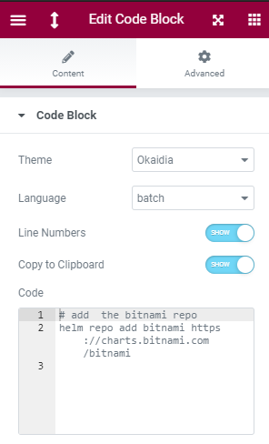
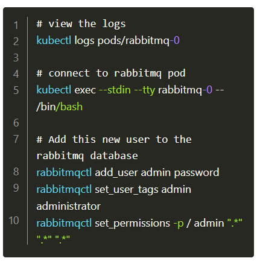

# Code Block Syntax Highlighter for Elementor

An Elementor widget which adds syntax highlighting to your site with PrismJS 1.22.0.
This plugin is free and is open source under the MIT license.

## Screenshots

 |    Elemetor plugin area    | |  Rendered plugin |
:-------------------------:|:-------------------------:|:-------------------------:
|  |

## How to Install

### From the WordPress Plugin Directory

The Official Code Block Syntax Highlighter for Elementor WordPress Plugin can be found here: https://wordpress.org/plugins/code-block-for-elementor/

### From this repository

Go to the [releases](https://github.com/thorstenalpers/wp-plugin-code-block-for-elementor/releases) of this repository and download the most recent release.

Then, from your WordPress administration panel, go to `Plugins > Add New` and click the `Upload Plugin` button at the top of the page.